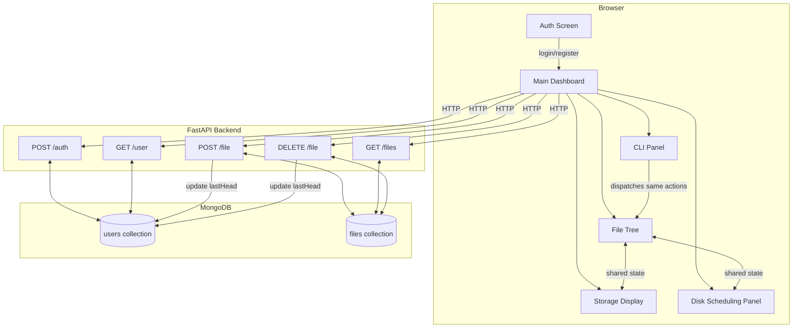

# Design Document: File System Disk Scheduler

## Overview

A single-page web application that simulates a file system with disk scheduling algorithms. Users authenticate, then interact with a dashboard that lets them manage simulated file metadata within a 100 MB storage quota and visualize how classic disk scheduling algorithms (FCFS, SSTF, SCAN) traverse the storage space.

No actual file content is stored. The system tracks only metadata — filename, path, size, start byte, end byte — and uses these byte offsets to simulate disk head movement.

**Tech stack:** React (frontend) · FastAPI (backend) · MongoDB (database)

**Key design decision:** Byte allocation logic lives entirely on the frontend. The frontend computes `start` and `end` for each new file by gap-finding over sorted existing records, then sends the computed values to the backend. The backend stores what it receives without re-computing allocation. This keeps the backend thin and stateless with respect to allocation strategy.

---

## Architecture



**Data flow summary:**

1. User authenticates → frontend stores `uid` and `lastHead` in React state (no localStorage/cookies beyond session).
2. All subsequent requests include `uid` as a query parameter or request body field.
3. File allocation is computed client-side; computed `start`/`end` are sent to `POST /file`.
4. After every mutating operation (add, delete, algorithm run), the backend updates `lastHead` on the user document.

---

## Components and Interfaces

### Frontend Components

#### `AuthScreen`

Renders email input, password input, Login button, and Register button. On success, transitions to `Dashboard` by updating top-level auth state.

#### `Dashboard`

Top-level authenticated view. Holds shared state:

- `files: FileRecord[]` — current user's file list
- `lastHead: number` — current disk head byte position
- `uid: string`

Passes state and mutating callbacks down to child panels.

#### `FileTree`

- Displays `files` filtered to the current directory path.
- "Add File" button → opens native `<input type="file">` picker → captures `name`, `webkitRelativePath` (or `name` as path), `size` → calls `onAddFile(filename, path, size)`.
- "Delete File" button → prompts for filename → calls `onDeleteFile(filename)`.
- Shows loading spinner while fetching; empty-state message when list is empty.
- Supports checkbox selection of files for scheduling.

#### `CLIPanel`

- Text input + submit.
- Parses commands: `open <folder>`, `del <filename>`, `touch <filename> [size]`.
- Delegates to the same `onAddFile` / `onDeleteFile` / `onNavigate` callbacks used by `FileTree`.
- Displays success/error output lines in a scrollable log.

#### `StorageDisplay`

- Renders a `<div>` (or `<canvas>`) 100% wide representing 100 MB.
- For each `FileRecord`, renders a red `<span>` with `left = (start / QUOTA) * 100%` and `width = (size / QUOTA) * 100%`.
- Grey background covers the full bar; red segments overlay it.
- Displays `"X MB / 100 MB"` numeric label.
- Reactively re-renders whenever `files` changes.

#### `DiskSchedulingPanel`

- Reads selected files from `FileTree` (passed via shared state).
- Algorithm selector: FCFS, SSTF, SCAN (radio or dropdown).
- "Run Simulation" button → calls `runScheduler(algorithm, selectedFiles, lastHead)` → displays traversal sequence and total seek distance.
- After simulation, calls `onUpdateLastHead(newHead)` which PATCHes `lastHead` via `GET /user` refresh or a dedicated update call.

### Backend Modules

#### `auth_router` (`POST /auth`)

Handles both register and login based on `action` field. Returns `uid` + `lastHead` on success.

#### `user_router` (`GET /user`)

Returns user document fields: `uid`, `email`, `lastHead`, `createdAt`.

#### `file_router` (`POST /file`, `GET /files`, `DELETE /file`)

CRUD for file metadata. Updates `lastHead` on the user document after add and delete.

### Scheduler (Frontend Module)

Pure functions — no network calls:

```typescript
function runFCFS(positions: number[], initialHead: number): SchedulerResult;
function runSSTF(positions: number[], initialHead: number): SchedulerResult;
function runSCAN(
  positions: number[],
  initialHead: number,
  maxByte: number,
): SchedulerResult;

interface SchedulerResult {
  sequence: number[]; // ordered list of byte positions visited
  seekDistance: number; // sum of |pos[i+1] - pos[i]| across all moves
  finalHead: number; // last position reached
}
```

After a simulation completes, the frontend calls `PATCH /user` — but since the spec defines only `GET /user`, the `lastHead` update after scheduling is sent via a lightweight `POST /file`-adjacent mechanism. **Design decision:** the frontend calls `GET /user` to refresh state, and the `lastHead` update after scheduling is persisted by sending a dedicated request. Since the API is fixed to 5 endpoints, the scheduling `lastHead` update is piggybacked: the frontend sends a `POST /file` with a zero-byte sentinel, or — more cleanly — the backend exposes `lastHead` update as part of the `GET /user` response after the frontend triggers it via a query param.

**Revised decision:** To stay within the 5-endpoint constraint, the disk scheduling `lastHead` update is handled by having the frontend call `GET /user?uid=...&updateHead=<newHead>` — a side-effectful GET, which is unconventional but keeps the API surface minimal. Alternatively, the `DELETE /file` or `POST /file` endpoints could carry an optional `lastHead` override. The cleanest approach within constraints: **add an optional `lastHead` field to `POST /file` and `DELETE /file` request bodies**, and expose a `lastHead` update path through `GET /user` with an optional `set_head` query parameter. This is documented explicitly so implementers are aware of the intentional side effect.

---

## Data Models

### MongoDB: `users` collection

```json
{
  "uid": "string (UUID v4)",
  "email": "string (unique, indexed)",
  "password": "string (bcrypt hash)",
  "lastHead": "number (byte offset, default 0)",
  "createdAt": "datetime (UTC)"
}
```

### MongoDB: `files` collection

```json
{
  "id": "string (UUID v4)",
  "filename": "string",
  "path": "string",
  "size": "number (bytes)",
  "start": "number (Start_Byte)",
  "end": "number (End_Byte = start + size - 1)",
  "createdAt": "datetime (UTC)",
  "uid": "string (foreign key → users.uid, indexed)"
}
```

Index: `{ uid: 1, filename: 1 }` (unique per user) to enforce no duplicate filenames per user.

### API Request/Response Shapes

#### `POST /auth`

```json
// Request
{ "action": "register" | "login", "email": "string", "password": "string" }

// Response (success)
{ "uid": "string", "lastHead": 0 }

// Response (error)
{ "error": "string" }
```

#### `GET /user?uid=<uid>`

```json
// Response
{ "uid": "string", "email": "string", "lastHead": 0, "createdAt": "datetime" }
```

#### `POST /file`

```json
// Request
{ "uid": "string", "filename": "string", "path": "string", "size": 0, "start": 0, "end": 0 }

// Response
{ "id": "string", "filename": "string", "path": "string", "size": 0, "start": 0, "end": 0, "createdAt": "datetime", "uid": "string" }
```

#### `GET /files?uid=<uid>`

```json
// Response
[
  {
    "id": "string",
    "filename": "string",
    "path": "string",
    "size": 0,
    "start": 0,
    "end": 0,
    "createdAt": "datetime"
  }
]
```

#### `DELETE /file?uid=<uid>&filename=<filename>`

```json
// Response
{ "success": true, "deletedFile": { ...FileRecord } }
```

### Frontend State Shape

```typescript
interface FileRecord {
  id: string;
  filename: string;
  path: string;
  size: number;
  start: number;
  end: number;
  createdAt: string;
}

interface AppState {
  uid: string;
  email: string;
  lastHead: number;
  files: FileRecord[];
  currentPath: string;
  selectedFileIds: Set<string>;
}
```

### Byte Allocation Algorithm (Frontend)

```typescript
const QUOTA = 104_857_600; // 100 MB in bytes

function allocate(
  files: FileRecord[],
  newSize: number,
): { start: number; end: number } | null {
  const sorted = [...files].sort((a, b) => a.start - b.start);

  // Check gap before first file
  if (sorted.length === 0 || sorted[0].start >= newSize) {
    const start = sorted.length === 0 ? 0 : 0;
    if (sorted.length === 0 || sorted[0].start >= newSize) {
      return { start: 0, end: newSize - 1 };
    }
  }

  // Check gaps between consecutive files
  for (let i = 0; i < sorted.length - 1; i++) {
    const gapStart = sorted[i].end + 1;
    const gapEnd = sorted[i + 1].start - 1;
    if (gapEnd - gapStart + 1 >= newSize) {
      return { start: gapStart, end: gapStart + newSize - 1 };
    }
  }

  // Fallback: space after last file
  const afterLast = sorted.length > 0 ? sorted[sorted.length - 1].end + 1 : 0;
  if (afterLast + newSize <= QUOTA) {
    return { start: afterLast, end: afterLast + newSize - 1 };
  }

  return null; // quota exceeded
}
```

---

## Correctness Properties

_A property is a characteristic or behavior that should hold true across all valid executions of a system — essentially, a formal statement about what the system should do. Properties serve as the bridge between human-readable specifications and machine-verifiable correctness guarantees._

### Property 1: Registration produces a complete user document

_For any_ valid email and password pair, a successful registration response shall contain all required fields: `uid`, `email`, `lastHead` (equal to 0), and `createdAt`.

**Validates: Requirements 1.2**

---

### Property 2: Duplicate email registration is always rejected

_For any_ email address, if a user with that email has already been registered, a second registration attempt with the same email shall always return an error response.

**Validates: Requirements 1.3**

---

### Property 3: Login returns uid and lastHead for any registered user

_For any_ registered user, a login request with the correct email and password shall return that user's `uid` and `lastHead`.

**Validates: Requirements 1.4**

---

### Property 4: Invalid credentials always return an error

_For any_ email/password combination that was never registered, a login request shall always return an error response indicating invalid credentials.

**Validates: Requirements 1.5**

---

### Property 5: File_Tree renders filename and size for any FileRecord

_For any_ `FileRecord`, the rendered File_Tree row shall contain both the `filename` and the `size` value.

**Validates: Requirements 2.2**

---

### Property 6: File metadata capture is complete for any selected file

_For any_ file object provided by the browser's file picker, the capture function shall extract `filename`, `path`, and `size` without loss or mutation.

**Validates: Requirements 2.5**

---

### Property 7: CLI parser recognizes all valid commands for any valid input

_For any_ string that begins with `open`, `del`, or `touch` followed by a valid argument, the CLI parser shall dispatch the corresponding action without displaying an error.

**Validates: Requirements 3.1**

---

### Property 8: Unrecognized CLI commands always produce an error listing valid commands

_For any_ input string that does not begin with a recognized command prefix (`open`, `del`, `touch`), the CLI panel shall display an error message that lists the valid commands.

**Validates: Requirements 3.6**

---

### Property 9: Storage bar coverage is complete and numerically accurate

_For any_ set of `FileRecord`s, (a) every file's red segment shall have `left = (start / QUOTA) * 100%` and `width = (size / QUOTA) * 100%`, (b) the sum of all red segment widths plus all grey segment widths shall equal 100%, and (c) the numeric label shall display `sum(sizes)` as the used value and `QUOTA` as the total.

**Validates: Requirements 4.2, 4.3, 4.4**

---

### Property 10: Byte allocation never overlaps and always uses the earliest gap

_For any_ set of existing `FileRecord`s and any new file size that fits within the remaining quota, the `allocate` function shall return a `{start, end}` range that (a) does not overlap any existing file's `[start, end]` range, (b) has `end - start + 1 = size`, and (c) is the earliest (lowest `start`) valid gap that fits the file.

**Validates: Requirements 5.1**

---

### Property 11: POST /file stores a complete FileRecord for any valid input

_For any_ valid `POST /file` request, the stored and returned `FileRecord` shall contain all required fields: `id`, `filename`, `path`, `size`, `start`, `end`, and `createdAt`.

**Validates: Requirements 5.3, 9.4**

---

### Property 12: lastHead equals the added file's start byte after any file addition

_For any_ file addition that succeeds, the user's `lastHead` stored in the database shall equal the `start` byte of the newly added file.

**Validates: Requirements 5.4, 8.2**

---

### Property 13: Quota overflow is always rejected

_For any_ user whose current total used storage plus the new file's size exceeds 104,857,600 bytes, the `POST /file` request shall be rejected with an error response.

**Validates: Requirements 5.6**

---

### Property 14: Deleted file is absent from subsequent GET /files responses

_For any_ existing `FileRecord`, after a successful `DELETE /file` for that record, a subsequent `GET /files` for the same user shall not contain that record.

**Validates: Requirements 6.2, 9.5**

---

### Property 15: lastHead equals the deleted file's start byte after any file deletion

_For any_ file deletion that succeeds, the user's `lastHead` stored in the database shall equal the `start` byte of the deleted file.

**Validates: Requirements 6.3, 8.3**

---

### Property 16: Deleting a non-existent file always returns an error

_For any_ filename that does not exist in the user's file list, a `DELETE /file` request shall always return an error response indicating the file was not found.

**Validates: Requirements 6.5**

---

### Property 17: FCFS sequence matches createdAt order for any file set

_For any_ set of selected `FileRecord`s, the FCFS scheduler shall return a sequence of `start` byte positions in ascending `createdAt` order.

**Validates: Requirements 7.6**

---

### Property 18: SSTF always selects the nearest unvisited position

_For any_ set of `start` byte positions and any initial head position, at every step of the SSTF algorithm, the next position chosen shall be the one with the minimum absolute distance from the current head among all remaining unvisited positions.

**Validates: Requirements 7.7**

---

### Property 19: SCAN visits all positions in a directional sweep

_For any_ set of `start` byte positions and any initial head position, the SCAN algorithm shall visit all positions in one direction (ascending to the boundary) before reversing, visiting each position exactly once.

**Validates: Requirements 7.8**

---

### Property 20: Seek distance equals the sum of absolute differences in the sequence

_For any_ scheduler result, `seekDistance` shall equal `Σ |sequence[i+1] − sequence[i]|` for all consecutive pairs in the returned sequence.

**Validates: Requirements 7.9**

---

### Property 21: lastHead equals the final position after any scheduling simulation

_For any_ completed scheduling simulation, the user's `lastHead` persisted to the database shall equal the last element of the returned sequence.

**Validates: Requirements 7.10, 8.4**

---

### Property 22: GET /user returns all required fields for any registered user

_For any_ registered user, `GET /user` shall return a response containing `uid`, `email`, `lastHead`, and `createdAt` with values matching the stored user document.

**Validates: Requirements 9.2**

---

### Property 23: GET /files returns exactly the files belonging to the requesting user

_For any_ user with N files, `GET /files` shall return exactly N records, all with `uid` matching the requesting user, and no records belonging to other users.

**Validates: Requirements 9.3**

---

### Property 24: Any endpoint with an invalid uid returns HTTP 401

_For any_ of the five endpoints, a request with a missing or invalid `uid` shall always return an HTTP 401 response.

**Validates: Requirements 9.6**

---

### Property 25: Any backend error response produces a human-readable frontend message

_For any_ error response returned by the backend (4xx or 5xx), the frontend shall display a non-empty, human-readable error message to the user.

**Validates: Requirements 10.1**

---

## Error Handling

### Backend Error Responses

| Condition                 | HTTP Status | Response Body                             |
| ------------------------- | ----------- | ----------------------------------------- |
| Email already registered  | 400         | `{ "error": "Email already registered" }` |
| Invalid login credentials | 401         | `{ "error": "Invalid credentials" }`      |
| Missing or invalid uid    | 401         | `{ "error": "Unauthorized" }`             |
| File not found (delete)   | 404         | `{ "error": "File not found" }`           |
| Storage quota exceeded    | 400         | `{ "error": "Storage quota exceeded" }`   |
| Database unreachable      | 503         | `{ "error": "Service unavailable" }`      |
| Unexpected server error   | 500         | `{ "error": "<descriptive message>" }`    |

### Frontend Error Handling

- All API calls are wrapped in try/catch; any caught error or non-2xx response triggers the global error display.
- Error messages are rendered in a dismissible toast or banner component.
- The CLI panel has its own inline error log separate from the global error display.
- Scheduling with no files selected is validated client-side before any API call.
- Quota overflow is validated client-side (sum of existing sizes + new size > QUOTA) before sending `POST /file`, providing instant feedback without a round-trip.

### Edge Cases

- **Zero-byte file (`touch <filename>`):** Allocated at the first available byte position with `start = end + 1` of the previous file (or 0 if no files). `size = 0`, `end = start - 1` (empty range). The storage bar renders no visible segment.
- **Exactly full quota:** The last file fills the quota exactly. Subsequent add attempts are rejected with a quota-exceeded error.
- **Single file selected for scheduling:** All three algorithms produce a sequence of length 1 with seek distance = |lastHead − start|.
- **Concurrent operations:** The backend does not implement optimistic locking. Last-write-wins for `lastHead` updates. This is acceptable for a simulation tool.

---

## Testing Strategy

### Dual Testing Approach

Both unit/example-based tests and property-based tests are used. Unit tests cover specific scenarios, integration points, and edge cases. Property tests verify universal invariants across randomized inputs.

### Property-Based Testing Library

**Frontend (TypeScript/React):** [fast-check](https://github.com/dubzzz/fast-check)  
**Backend (Python/FastAPI):** [Hypothesis](https://hypothesis.readthedocs.io/)

Each property test runs a minimum of **100 iterations**.

Tag format for each property test:

```
// Feature: file-system-disk-scheduler, Property <N>: <property_text>
```

### Unit Tests

**Auth:**

- Auth screen renders all four elements (email, password, login, register)
- Successful login navigates to dashboard without page reload
- Failed login shows error message

**File Tree:**

- Renders loading indicator while fetching
- Renders empty-state message when file list is empty
- "Add File" triggers file picker
- "Delete File" shows confirmation prompt

**CLI Panel:**

- `open myfolder` triggers navigation
- `del myfile.txt` triggers delete flow
- `touch newfile.txt` triggers add with size 0
- Successful command shows confirmation
- `del nonexistent.txt` shows file-not-found error

**Storage Display:**

- Adding a file updates the bar reactively
- Deleting a file removes the segment reactively
- Full quota shows quota-full indicator

**Disk Scheduling Panel:**

- Algorithm selector contains FCFS, SSTF, SCAN
- Simulation with no files selected shows error
- Simulation result displays sequence and seek distance

**Backend:**

- Database unreachable returns HTTP 503
- Unexpected error returns HTTP 500

### Property Tests

Each of the 25 correctness properties above is implemented as a single property-based test. Key generators:

- **`arbEmail`**: generates valid email strings
- **`arbPassword`**: generates non-empty strings
- **`arbFileRecord`**: generates FileRecord with valid start/end/size relationships
- **`arbFileSet`**: generates non-overlapping sets of FileRecords within quota
- **`arbBytePosition`**: generates integers in [0, QUOTA)
- **`arbCommandString`**: generates strings starting with open/del/touch or random invalid prefixes

### Integration Tests

- Full add-file flow: file picker → allocate → POST /file → GET /files confirms record present
- Full delete-file flow: DELETE /file → GET /files confirms record absent
- Full scheduling flow: select files → run algorithm → verify lastHead updated in DB
- Auth flow: register → login → access protected endpoint
